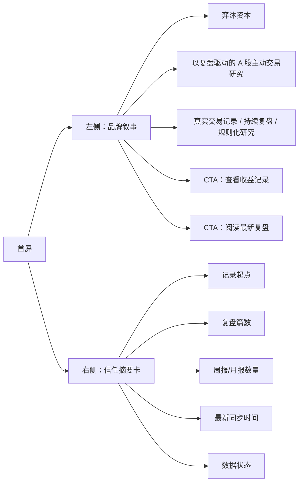
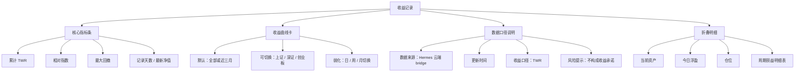
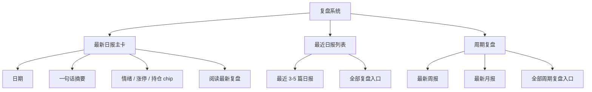
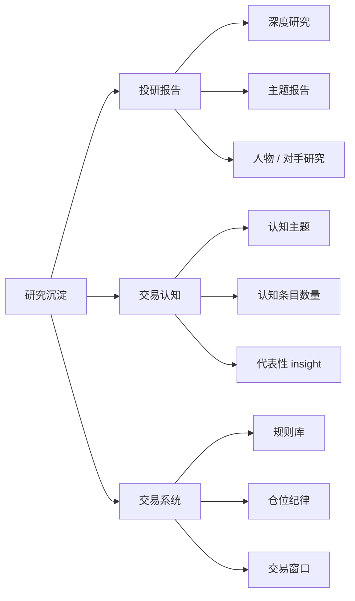
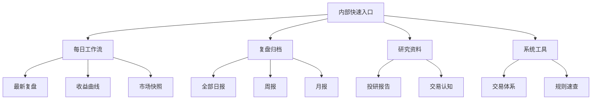
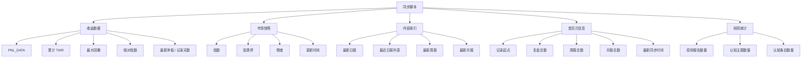

# 弈沐资本 Portal 2.0 首页重构记录

日期：2026-05-28  
项目：`/Users/yimu/Documents/YM_Capital/portal`  
状态：已实现，作为 Portal 2.0 架构记录保留

## 1. 重构目标

Portal 首页从“内部工作平台入口”调整为“弈沐资本对外展示窗口”。

核心目标：

- 对外建立信任：品牌、投资方法论、真实收益记录、持续复盘能力、研究沉淀。
- 对内保留效率：快速进入最新复盘、全部复盘、周/月复盘、收益曲线、交易体系、认知库、投研资源。
- 风格保持克制、专业、长期主义、研究型资产管理人。
- 避免首页变成 dashboard，不做过度 KPI 平铺。

## 2. 首页整体信息架构

首页采用“对外叙事优先，内部入口收束”的结构。

```mermaid
flowchart TD
  A["首页 Home"] --> B["首屏品牌区"]
  A --> C["投资方法论"]
  A --> D["收益记录"]
  A --> E["复盘系统"]
  A --> F["研究沉淀"]
  A --> G["内部快速入口"]
  A --> H["页脚与风险说明"]

  B --> B1["品牌定位"]
  B --> B2["信任摘要"]
  B --> B3["主 CTA"]

  C --> C1["市场状态识别"]
  C --> C2["资金合力判断"]
  C --> C3["仓位与风险纪律"]
  C --> C4["复盘与红蓝对抗"]

  D --> D1["核心收益指标"]
  D --> D2["中长期收益曲线"]
  D --> D3["数据口径说明"]
  D --> D4["折叠明细"]

  E --> E1["最新日报"]
  E --> E2["最近日报列表"]
  E --> E3["周度复盘"]
  E --> E4["月度复盘"]

  F --> F1["投研报告"]
  F --> F2["交易认知"]
  F --> F3["交易系统"]

  G --> G1["最新复盘"]
  G --> G2["全部复盘"]
  G --> G3["周/月复盘"]
  G --> G4["收益曲线"]
  G --> G5["交易体系"]
  G --> G6["认知库"]
  G --> G7["投研资源"]
```



最终页面顺序：

1. 首屏品牌区
2. 今日市场状态
3. 收益记录
4. AI 复盘闭环
5. 人机协同交易框架
6. 研究与规则沉淀
7. 常用入口

## 3. 首屏设计

首屏承担“第一信任判断”，不承担行情看板职责。

### 3.1 模块结构



### 3.2 文案方向

主标题：

> 弈沐资本

最终主表达：

> AI 增强的 A 股短线趋势交易体系

辅助表达：

> AI 做研究和复盘，人做判断和取舍。

首屏 CTA：

- 查看收益记录
- 阅读最新复盘
- 进入内部工作台

### 3.3 首屏不放的东西

- 不放密集市场快照。市场快照独立放在收益记录前。
- 不放日内收益曲线。
- 不放过多交易系统入口。
- 不把“Work Portal / Daily Desk”作为主身份。

## 4. 收益曲线展示方案

收益区目标是“可信”，不是“刺激”。

### 4.1 收益区模块



### 4.2 展示原则

- 默认展示中长期曲线，避免默认日内波动。
- 核心指标最多 4 个。
- 指标必须配口径，不只给数字。
- 今日浮盈、今日仓位等内部指标默认折叠。
- 曲线旁保留“完整复盘可回溯”的入口，形成数据和文字证据闭环。

### 4.3 信任文案

建议放在收益区底部：

> 收益记录由 Hermes 云端 bridge 同步，首页仅展示已同步数据。收益口径采用 TWR，用于展示投资过程，不构成收益承诺。每个交易日可回溯到对应复盘记录。

## 5. 复盘、周笔记、投研、认知组织

这些内容统一归入“研究沉淀”，但复盘系统单独突出。

### 5.1 复盘系统



日报证明执行密度，周/月报证明归纳能力。

### 5.2 研究沉淀



命名建议：

- “投研资源”改为“投研报告”
- “交易认知”可保留
- “交易系统”对外可称“交易规则体系”
- “工具”入口对外弱化，不在首页使用工具感表达

## 6. 内部快速入口

内部入口集中收束，不与对外叙事同层竞争。



展示方式建议：

- 页面后半段做一块“工作台入口”。
- 用小型链接矩阵，不使用大面积卡片。
- 视觉上低调，但入口必须完整。

## 7. 自动同步数据边界

首页需要从脚本自动生成的内容分为 5 类。



### 7.1 建议的 HTML marker

Portal 2.0 已使用明确 marker 同步关键数据块。

当前 marker：

```html
<!-- PNL_DATA_START -->
<!-- PNL_DATA_END -->

<!-- MARKET_SNAPSHOT_START -->
<!-- MARKET_SNAPSHOT_END -->
```

### 7.2 脚本职责建议

- `sync_pnl_data.py`
  - 继续负责 Hermes 云端 bridge 数据。
  - 更新 PnL 数据块、收益摘要、市场快照、同步时间。

- `convert_review.py`
  - 继续负责复盘 HTML 生成。
  - 更新最新日报、复盘列表、日报统计。

- 后续可新增 `sync_home_index.py`，如果首页自动内容继续变多：
  - 汇总日报、周报、月报、投研、认知统计。
  - 避免所有首页逻辑塞进 `convert_review.py`。

## 8. 分阶段执行计划

### 阶段 1：首页静态结构重排

范围：

- 重写首页 HTML 结构。
- 保留现有 CSS 基础变量。
- 不先改同步脚本。
- 暂时手工保留当前最新内容。

验收标准：

- 首页标题和首屏定位变成对外门户。
- 首屏不再像内部 dashboard。
- 导航层级清晰：收益记录、AI 复盘、协同框架、研究沉淀、常用入口。
- 桌面端和移动端都能正常阅读。

### 阶段 2：收益区重构

范围：

- 复用现有 `PNL_DATA`。
- 改收益区布局和默认展示逻辑。
- 默认中长期曲线。
- 今日数据和明细默认折叠。

验收标准：

- 核心指标不超过 4 个。
- 显示 TWR、数据来源、更新时间、风险提示。
- 曲线切换正常。
- 不破坏现有 PnL 数据同步。

### 阶段 3：复盘与研究沉淀模块

范围：

- 最新日报主卡。
- 最近日报列表。
- 周/月复盘入口。
- 投研报告、交易认知、交易规则体系三列组织。

验收标准：

- 最新复盘入口准确。
- 全部复盘入口准确。
- 周报/月报入口不被日报淹没。
- 对外读者能理解“持续复盘能力”和“研究沉淀”。

### 阶段 4：同步脚本升级

范围：

- 增加稳定 marker。
- 更新首页元信息、收益摘要、最新复盘、研究统计。
- 减少脆弱的字符串定位。

验收标准：

- `python3 tools/sync_pnl_data.py` 正常同步收益和市场快照。
- `python3 tools/convert_review.py <vault_md_path>` 后首页最新复盘同步正常。
- 同步失败明确报错，不静默写旧数据。
- 多次运行脚本不会重复插入内容。

### 阶段 5：浏览器验证与上线准备

范围：

- 本地静态服务或直接打开首页验证。
- 检查移动端。
- 检查同步脚本后页面是否破版。

验收标准：

- 桌面端首屏像专业门户，不像工具台。
- 移动端首屏、收益曲线、卡片无横向溢出。
- 所有链接可点击。
- PnL 图表正常渲染。
- Git diff 只包含首页和必要脚本改动。

## 9. 已确认实现点

1. 首页采用“首屏品牌区 → 今日市场状态 → 收益记录 → AI 复盘闭环 → 人机协同交易框架 → 研究与规则沉淀 → 常用入口”。
2. 收益曲线保留日、周、月和指数对照能力。
3. 市场快照独立成模块，放在收益记录前，避免挤占首屏。
4. 首页近期复盘展示 6 条，并展示市场快照核心指标。
5. 同步脚本已覆盖首页、详情页和归档页更新。
